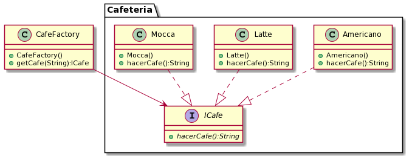

## Design pattern

Providing a static method encapsulated in a class called the factory, to hide the implementation logic and make client code focus on usage rather than initializing new objects

Wikipedia
>Factory is an object for creating other objects -formally a factory is a function or methos that returns objects of a varying prototype or class

## Code

```java
package products;
import java.util.*;

public class CafeFactory {
    public ICafe getCafe(String i){
        ICafe cafe;
        switch(i){
            case "bajo":
                cafe= new Americano();
                break;
            case "medio":
                cafe = new Latte();
                break;
            case "alto":
                cafe = new Mocca();
                break;
            default:
                cafe = null;
            
               
        }
        return cafe;
    }
    
}
```
Depending on the type of coffee entered, the factory will create and return the object. 

# Description of the problem

A coffee shop wants to be able to automatically order caffees according to the quantity of milk. These coffees are divided into Latte, Mocca and Americano

## Class Diagram


