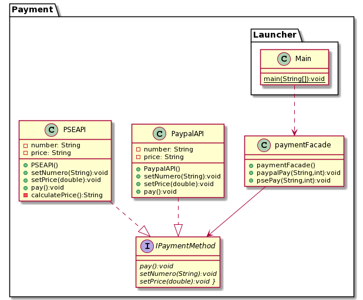

---

DesingPattern: Facade
Title: paymentMethod
Categories: Structural
Language: es/en

---
## Facade Pattern

Facade define a higher-level interface that makes the subsystem easier to use

Wikipedia

>A facade is an object that provides a simplified interface to a large body of code, such as a class library.

## Description Problem

It is a payment system with Paypal and PSE as options. The facade is used to "manage" each of the APIs of the payment Methods

## Class diagram

