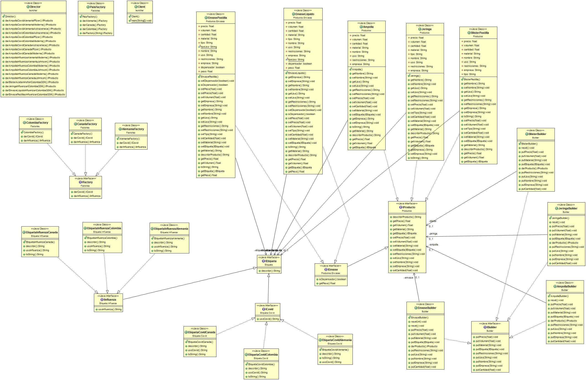

## Design pattern

Separate the construction of a complex object from its representation so that the same construction process can create different representations.

Wikipedia
>The builder pattern is an object creation software design pattern with the intentions of finding a solution to the telescoping constructor anti-pattern.

## Description of the problem

A company that manufactures and distributes pharmaceutical packaging needs to automate its production and distribution processes due to its large product catalog. This company distributes its 4 product families in 3 countries: syringes, vaccine containers and syrups as well as blister packs for capsules. Each of these products must comply with the restrictions.

## Code
```java
package Builder;

import Etiqueta.IEtiqueta;

public interface IBuilder {
    public void putPrecio(float a);
    public void putVolumen(float a);
    public void putMaterial(String a);
    public void putEtiqueta(IEtiqueta et);
    public void putRestricciones(String a);
    public void putUso(String a);
    public void putNombre(String a);         
    public void putEmpresa(String a);
    public void putCantidad(float a);
}
```

The constructor creates each attribute of the object, so in the interface we can see that there are functions that set the attributes that later need the syringes, vaccines or ampoules to be created.

## Class Diagram


