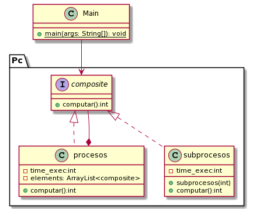

## Design pattern

Composite is a structural design pattern that allows you to compose objects into tree structures and work with those structures as if they were individual objects.

Wikipedia

> In software engineering, the composite pattern is a partitioning design pattern. The composite pattern describes that a group of objects is to be treated in the same way as a single instance of an object. The intent of a composite is to "compose" objects into tree structures to represent part-whole hierarchies. Implementing the composite pattern lets clients treat individual objects and compositions uniformly.

# Codes
```java
public interface composite {
	
	public int computar();
	
}
```

```java
public class Procesos implements composite {
	private int time_exec=0;
	private ArrayList<composite> elements= new ArrayList<composite>();
	

	public int computar() {
		for(composite a: elements) {
			time_exec+=a.computar();
		}
		return time_exec;
	}

	public int getTime_exec() {
		return time_exec;
	}

	public void setTime_exec(int time_exec) {
		this.time_exec = time_exec;
	}

	public ArrayList<composite> getElements() {
		return elements;
	}

	public void setElements(ArrayList<composite> elements) {
		this.elements = elements;
	}
	
}
```

```java
public class subprocesos implements composite {
	
	private int time_exec;
	
	public subprocesos(int time) {
		this.time_exec=time;
	}
	
	public int computar() {
		// TODO Auto-generated method stub
		return this.time_exec;
	}

	public int getTime_exec() {
		return time_exec;
	}

	public void setTime_exec(int time_exec) {
		this.time_exec = time_exec;
	}
	
}
```

# Advantages

* You can work with complex tree structures more comfortably: use polymorphism and recursion to your advantage.

* Se pueden añadir nuevos componentes fácilmente.

# disadvantages

* It can be difficult to provide a common interface for classes whose functionality differs too much. In some cases, you will have to overgeneralize the component interface, making it more difficult to understand.

* It could make the design too general, especially when we want to restrict the components that can be part of a given compound.

# Description of the problem

It is necessary to calculate the execution time, where each task has an execution time and these are grouped in a certain number of processes to be processed by the CPU.

## Class Diagram


