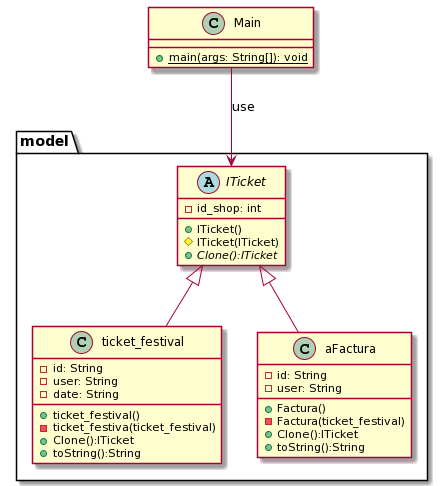

## Design pattern

Prototyping is a creative design pattern that allows us to copy existing objects without relying on code.

Wikipedia
>The prototype pattern is a creational design pattern in software development. It is used when the type of objects to create is determined by a prototypical instance, which is cloned to produce new objects.

# Advantages

* You can clone objects without attaching them to their concrete classes.
* You can avoid repeated initialization code by cloning prefabricated prototypes.

* You can create complex objects more easily.

* You get an alternative to inheritance when dealing with configuration presets for complex objects.

# disadvantages

It is a very robust way to solve the creation of expensive objects if you do not create many objects dynamically, it hides the client dependencies, all classes have to implement a CLONE() method in order to "create" a new object.

# Description of the problem

It is necessary to clone objects such as a store or festival bill. where the structure should not change but the variables such as the bill id or the store and the customer should change.

## Class Diagram

