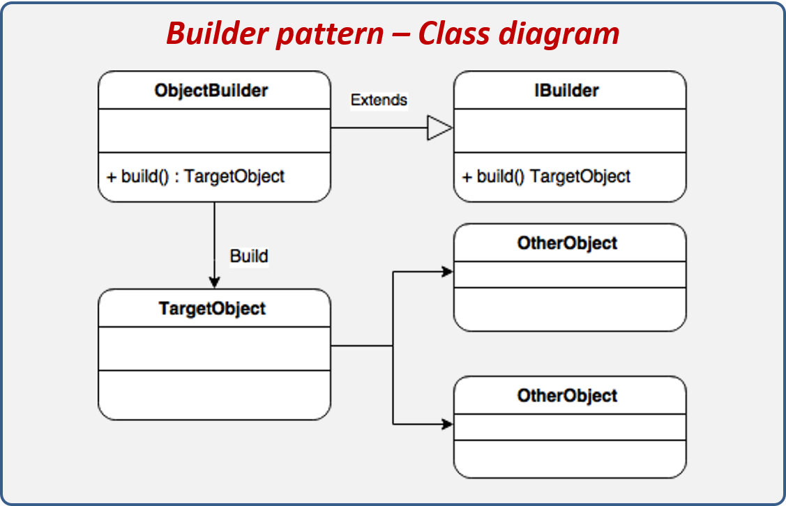
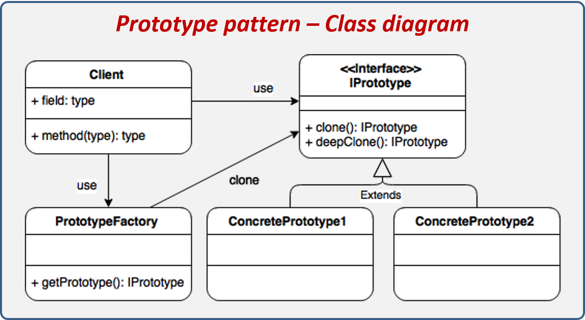

# Design patterns

>These are techniques for solving common problems in software development and other areas related to interaction or interface design.
>
>A design pattern is a solution to a design problem.

## Creational patterns

### [Factory](./Cafeteria)

### [Abstract Factory](./Videojuego)

### [Builder](./Farmaceutica)

### [Singleton](./Singleton)

### [Prototype](./Proto_type)

## Structural patterns

### [Facade](./Facade)

### [Composite](./PC)

## Behavioral patterns

### Observer

## credits

* [README design](https://github.com/iluwatar/java-design-patterns)

