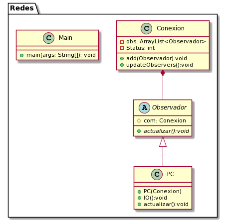

## Design pattern

Observer is a behavioral design pattern that allows you to define a subscription mechanism to notify various objects about any event that happens to the object they are observing.

Wikipedia
> The observer pattern is a software design pattern in which an object, called the subject, maintains a list of its dependents, called observers, and notifies them automatically of any state changes, usually by calling one of their methods.

# Advantages

* Open/closed principle. You can introduce new subscriber classes without having to change the notifier code (and vice versa if there is a notifier interface).

* provides a loosely coupled design between the interacting objects. This means that the objects do not know much about each other. The observed only knows the interface implemented by the observers, adding or removing observers does not require modifying the observed and both classes can be used independently (observed and observer).

# disadvantages

* The memory leak is a big and capable only disadvantage. This is because adding or removing observers has to be done explicitly. Even if the observers are no longer used, the reference remains to notify it and this makes the garbage collector not to remove it.

* Subscribers are notified in a random order.

# Description of the problem

For the transmission of information between devices, an optionality is necessary to avoid an overload of information while the device is sending or receiving data, no action can be taken until this transmission has been completed.

## Class Diagram

