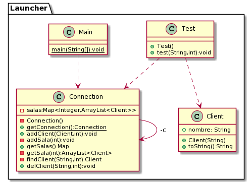

---

DesignPattern: Singleton
Title: Servers
Categories: Creational
Language: es/en

---

## Singleton pattern

Ensure a class only has one instance, and provide a global point of access to it

Wikipedia
> In software engineering, the singleton pattern is a software desing pattern that restricts the instantiation of a class to one object. This is useful when exactly one object is need to coordinate actions across the system.

## Description of the problem

Make a meet style server that allows to add clients in rooms, these roomes must be able to be created, managed and deleted when there are no more clients

## Code

```java
package launcher;

import java.util.ArrayList;
import java.util.HashMap;
import java.util.List;
import java.util.Map;

public class Connection {
    
    private static Connection c;
    private Map<Integer, ArrayList<Client>> salas = new HashMap<Integer, ArrayList<Client>>();

    private Connection(){
        System.out.println("Creaste instancia");
    }
    
    public static Connection getConnection(){
        if(c==null){
            c=new Connection();
        }
        return c;
    }
    
    public void addClient(Client c, int a){
       
        if (getSala(a)==null){
            addSala(a);    
        }
        getSala(a).add(c);
        
    }
    
    private void addSala(int a){
        this.salas.put(a, new ArrayList());
    }
    
    public Map getSalas(){
        return this.salas;
    }
    
    private ArrayList<Client> getSala(int a){
        return this.salas.get(a);
          
    }
    
    private Client findClient(String c,int a){
        ArrayList<Client> sala = this.getSala(a);
        for(int i=0;i<sala.size();i++){
            if(sala.get(i).nombre==c){
                return sala.get(i);
            }
        }
        return null;
        
    }
    
    public void delClient(String c, int a){
        if (this.getSala(a)==null){
            System.out.println("No");
        }
        else{
            Client cc = this.findClient(c, a);
            this.salas.get(a).remove(cc);

            if (this.getSala(a).isEmpty()){
                this.salas.remove(a);
            }
        }  
    }
}
```

the connection class is an independent instance which will do the meet work so it can only be created once and that is why the constructor is private and the way to use it is through getConnection that verifies if the instance has already been created or not and thus to be able to create it and return it or only return the instance.

## Class Diagram

