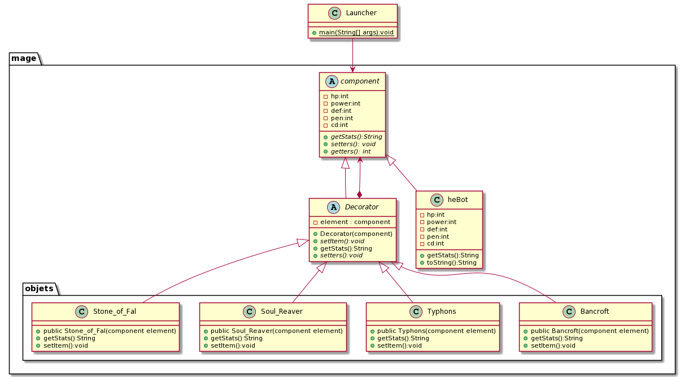

## Design pattern

The decorator is a structural design pattern that allows adding functionality to objects by placing these objects inside special encapsulated objects that contain this functionality.

Wikipedia
> In object-oriented programming, the decorator pattern is a design pattern that allows behavior to be added to an individual object, either statically or dynamically, without affecting the behavior of other objects from the same class. The decorator pattern is often useful for adhering to the Single Responsibility Principle, as it allows functionality to be divided between classes with unique areas of concern.

# Advantages

* You can extend the behavior of an object without creating a new subclass.
* Single responsibility principle. You can divide a monolithic class that implements many possible variants of behavior into several smaller classes.

# disadvantages

* A decorator and its components are not identical, from the point of view of object identity, but from the programmer's or client's point of view they could be considered the same.
* long call chains of decorated objects (i.e. extended components) often make error detection and thus also the debugging process more difficult.
* High software complexity (especially the Decorator interface) 

# Description of the problem

In a well-known multiplayer game (Smite), there are a large number of gods that have a base configuration but their attributes can be improved by purchasing items and depending on the items purchased they will have one role or another in the game. 

### Code

```java

public abstract class component {

	private int hp;
	private int power;
	private int def;
	private int pen;
	private int cd;
	
	public abstract String getStats();
    \\Setters and getters
  }
```
This class has the base attributes for each of the gods (game characters). So this class will be extended for character creation and purchasable items (decorators).
```java
public abstract class Decorator extends component {
      private component element;

      public Decorator(component element) {
        this.element = element;
      }

      public abstract void setItem();

      public String getStats() {
        return element.getStats();
      }
      \\Setters and getters
}

```
This class is the decorator, which will receive an element of type component to which it will add the characteristics of the "element".

```java
public class HeBot extends component{
	
	private int hp=400;
	private int power=35;
	private int def=39;
	private int pen=0;
	private int cd=0;

	//setters and getters

	@Override
	public String getStats() {
		return this.toString();
	}

  @Override
	public String toString() {
		return "HeBot [hp=" + hp + ", power=" + power + ", def=" + def + ", pen=" + pen + ", cd=" + cd + "]";
	}
	
	
}
```
a character named He bo is created with the character's base statistics that will later be modified by the objects he "buys".
```java
public class Typhons extends Decorator{

	public Typhons(component element) {
		super(element);
		setItem();
	}
	
	
	
	public String getStats() {
		return super.getStats();
	}


	public void setItem() {
		super.setPower(70);
		super.setPen(10);
		
	}
	
}
```
One of these purchase items is the Typhons, which will increase your damage and penetration percentage.

### He bo action
```java
public static void main(String[] args) {
		component c = new HeBot();
		System.out.println("Hebo base "+c.getStats()+"\n");
		c =  new Bancroft(c);
		System.out.println("Hebo 1 item "+c.getStats()+"\n");
		c = new Typhons(c);
		System.out.println("Hebo 2 item "+c.getStats()+"\n");
		c = new Soul_Reaver(c);
		System.out.println("Hebo 3 item "+c.getStats()+"\n");
		c = new Stone_of_Fal(c);
		System.out.println("Hebo 4 item "+c.getStats()+"\n");
	}
```
### output
```console java

Hebo base HeBot [hp=400, power=35, def=39, pen=0, cd=0] 

Hebo 1 items HeBot [hp=450, power=135, def=39, pen=0, cd=0] // bancroft

Hebo 2 items HeBot [hp=450, power=205, def=39, pen=10, cd=0] // bancroft, Typhons

Hebo 3 items HeBot [hp=450, power=300, def=39, pen=10, cd=10] // bancroft, Typhons, soul reaver

Hebo 4 items HeBot [hp=650, power=335, def=119, pen=10, cd=10] // bancroft, Typhons, soul reaver, stone of fal

```


## Class Diagram


