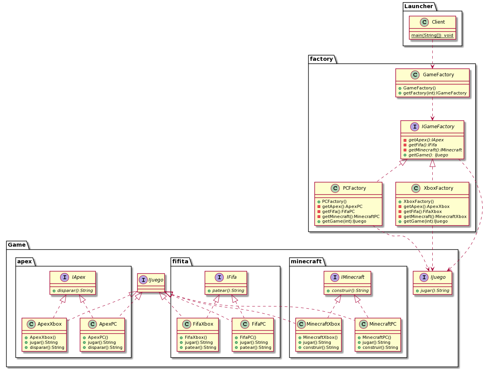

---

DesignPattern: Abstract factory
Title: videojuego
Categories: Creational
Languages: en/es

---

## Abstract Factory pattern

Provide an interaface for creating families of related or dependent objects without specifying their concrete classes

Wikipedia

>The abstract factory pattern provides a way to encapsulate a group of individual factories that have a common theme without specifying their concrete classes

## Description of the problem

A system for the creationa of videogames is meda taking into account the platform, in this case  the game are created for each platform (Xbox, Pc) asn then a game of the category is created. We can see the abstract factory pattern since a game of a family of games is created, such as FIFA, APEX or MINECRAFT.

## Code

```java
package factory;

import juegos.apex.*;
import juegos.fifita.*;
import juegos.*;
import juegos.minecraft.*;

public class PCFactory implements IGameFactory{
    public ApexPC getApex(){
        return new ApexPC();
    }
    public FifaPC getFifa(){
        return new FifaPC();
    }
    public MinecraftPC getMinecraft(){
        return new MinecraftPC();
    }
    public IJuego getGame(int i){
        IJuego juegos[] = {getApex(), getFifa(), getMinecraft()};
        return juegos[i];
    } 
}
```

In this case as in the factory pattern created video games for a particular platform.

```java
package factory;

public class GameFactory {
    public IGameFactory getFactory(int i){
        IGameFactory factories[] = {new XboxFactory(), new PCFactory()};
        return factories[i];
    }
    
}
```

Now in this case the factory will create a similar family factory. 

## Class Diagram


