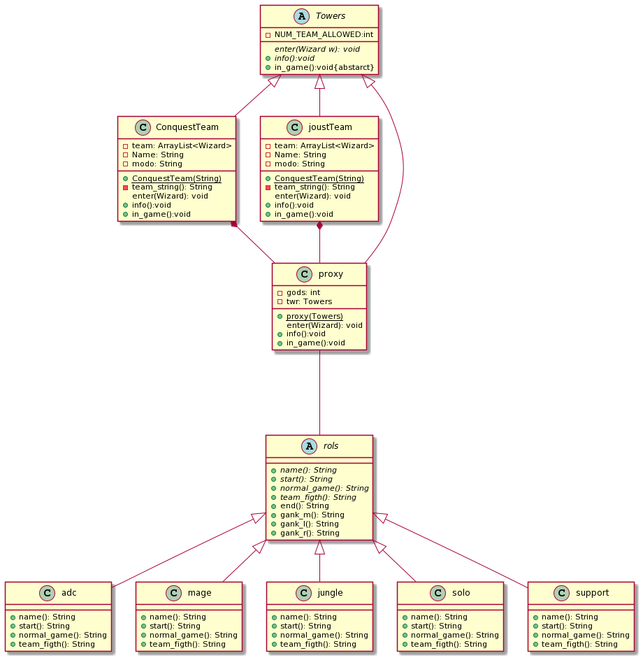

---

DesignPattern: proxy
Title: towers-smite
Categories: structural
Languages: en

---

## Abstract Factory pattern

In proxy pattern, we create object having original object to interface its functionality to outer world.

Wikipedia

>A proxy, in its most general form, is a class functioning as an interface to something else. A proxy is a wrapper or agent object that is being called by the client to access the real serving object behind the scenes. Use of the proxy can simply be forwarding to the real object, or can provide additional logic. In the proxy extra functionality can be provided, for example caching when operations on the real object are resource intensive, or checking preconditions before operations on the real object are invoked.

## Description of the problem

In smite there are different types of game modes, where each one has a certain amount of gods for the map, besides this they have different structures and mechanics so they are quite heavy objects.

## Code

```java
public abstract class Towers {
	abstract void enter(Wizard w);
	private int NUM_TEAM_ALLOWED=5;
	
	public int getNUM_TEAM_ALLOWED() {
		return NUM_TEAM_ALLOWED;
	}
	public void setNUM_TEAM_ALLOWED(int nUM_TEAM_ALLOWED) {
		NUM_TEAM_ALLOWED = nUM_TEAM_ALLOWED;
	}
	
	public abstract void info();
	public abstract void in_game();
}
```

This abstract class has the functions that will later implement the proxy and the object, and has a "Global" variable which is the number of gods allowed in the map.

```java
public class ConquiestTeam extends Towers{
	
	private ArrayList<Wizard> team ;
	private String Name;
	private String modo;
		
	public ConquiestTeam(String name) {
		this.team = new ArrayList<Wizard>();
		this.Name=name;
		this.modo="conquest";
		super.setNUM_TEAM_ALLOWED(5);
	}

	@Override
	void enter(Wizard w) {
		team.add(w);
	}

	public void info() {
		System.err.println(this.Name+" TEAM IN "+ this.modo);
		team.stream().forEach((a)-> { System.out.println(a.toString());});
	}
	
	private String team_string(){
		String aux="";
		int i=0;
		for(Wizard a: team) {
			aux+=i+". "+a.to_string_match()+"\n";
			i++;
		}
		aux+=i+". Exit\n";
		return aux;
	}
	
	public void in_game() {
		
		Scanner input = new Scanner(System.in);
		System.err.println("=============================");
		team.stream().forEach((a)-> { a.work("trats"); System.out.println("");});
		System.err.println("=============================");
		do {
			//game in progress	
		}while(true);
	}
		
}
```

This is an object that represents the map where the gods will face each other. 

```java
public class proxy extends Towers{
	
	private int gods;
	private Towers twr;
	
	public proxy(Towers tower) {
		this.twr=tower;
	}
	
	public void enter(Wizard w){
		if (gods < twr.getNUM_TEAM_ALLOWED()) {
	      twr.enter(w);
	      gods++;
	    }else {
	    	System.out.println("Full team \n Sorry "+w);
	    }
		
	}

	@Override
	public void info() {
		if(gods== twr.getNUM_TEAM_ALLOWED()) {
			System.out.println("Start Match");
			twr.info();
		}else {
			System.out.println("INCOMPLETE TEAM. missing= "+ (twr.getNUM_TEAM_ALLOWED()-gods));
			twr.info();
		}
		
	}

	@Override
	public void in_game() {
		twr.in_game();
	}
		
}
```

This is an object that represents the map where the gods will face each other. 

## Class Diagram


